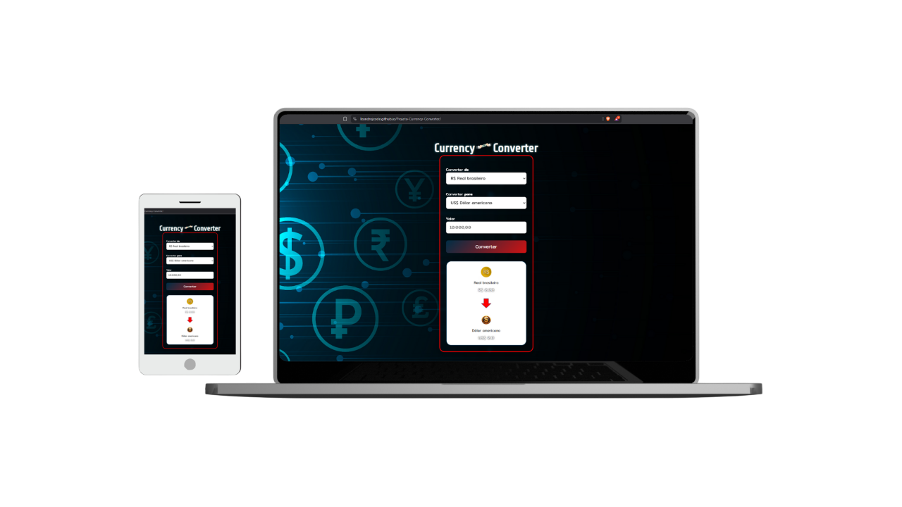

# 💱 Currency Converter
Projeto desenvolvido com foco em Frontend, aplicando práticas modernas de HTML, CSS e JavaScript para criar uma interface interativa e responsiva.
O conversor simula a conversão de moedas com valores dinâmicos e design otimizado para desktop e mobile.


---

## 🚀 Funcionalidades

✅ Conversão entre diversas moedas (Real, Dólar, Euro, Libra, Franco Suíço e Bitcoin)  
✅ Interface responsiva e centralizada  
✅ Alteração dinâmica de bandeiras e ícones das moedas  
✅ Formatação automática de valores por região  
✅ Fundo personalizado com design moderno  

---

## 🧠 Tecnologias utilizadas

- **HTML5** — Estrutura semântica e limpa  
- **CSS3** — Layout responsivo, sombras e estilização moderna  
- **JavaScript (ES6+)** — Lógica de conversão e manipulação de DOM  

---

## 🖼️ Demonstração

  
> Exemplo da interface com o sistema de conversão e ícones dinâmicos das moedas.

---

## ⚙️ Como executar o projeto

1. Clone este repositório:
   ```bash
   git clone https://github.com/seu-usuario/currency-converter.git

2. Acesse a pasta do projeto:
   cd currency-converter

3. Abra o arquivo index.html diretamente no navegador.


🎨 Detalhes técnicos

Cálculos baseados em valores fixos para simulação offline

Estrutura escalável e organizada (HTML + CSS + JS)


💡 Aprendizados

Durante o desenvolvimento, aprofundei conhecimentos em:

Manipulação de elementos do DOM

Eventos e atualização dinâmica da interface

Formatação internacional de moedas com Intl.NumberFormat()

Responsividade e estética com CSS puro

🌐 Deploy

🔗 [Veja o projeto online](https://leandrojcode.github.io/Projeto-Currency-Converter/)

Desenvolvido por **Leandro Jesus**  
[🔗 LinkedIn](https://www.linkedin.com/in/leandrojcode)
